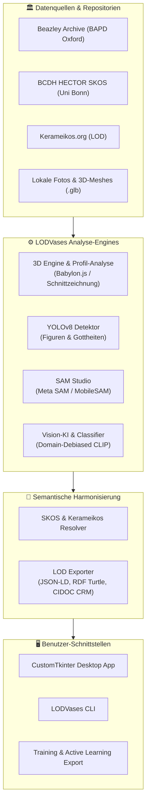

# LODVases 🏺
### Antike Vasen KI-Klassifikator, YOLOv8/SAM-Segmentierung, 3D-Studio & Semantische LOD/SKOS-Erschließung

[](https://www.python.org/)
[](https://pytorch.org/)
[](https://ultralytics.com/)
[](https://github.com/facebookresearch/segment-anything)
[](https://www.w3.org/standards/semanticweb/)
[](https://kerameikos.org/)
[](https://vocabs.bcdh.uni-bonn.de/hector_heritage_assets/de/)

**LODVases** ist ein integriertes Forschungs- und Analyseframework für antike mediterrane und griechische Keramik (Attisch Rotfigurig, Schwarzfigurig, Weißgrundig, Korinthisch, Geometrisch, etc.). Es verknüpft moderne Computer Vision (Vision Transformer/CLIP, YOLOv8 Objekterkennung, Segment Anything / SAM) und 3D-Mesh-Analytik (Babylon.js, Profil- und Schnittzeichnung) nahtlos mit semantischen Linked Open Data (LOD) Wissensgraphen über den **BCDH HECTOR SKOS-Thesaurus**, **Kerameikos.org** und das **Beazley Archive (BAPD, Oxford University)**.

---

## 📑 Inhaltsverzeichnis

- [🌟 Kernfunktionen](#-kernfunktionen)
- [🏗️ Systemarchitektur](#️-systemarchitektur)
- [📦 Installation & Vorbereitung](#-installation--vorbereitung)
- [🖥️ Desktop-Applikation (GUI)](#️-desktop-applikation-gui)
- [💻 Kommandozeilen-Schnittstelle (CLI)](#-kommandozeilen-schnittstelle-cli)
- [🏺 3D-Vasen-Studio & Schnittzeichnung](#-3d-vasen-studio--schnittzeichnung)
- [🎯 KI-Objekterkennung & Active Learning](#-ki-objekterkennung--active-learning)
- [🔗 Linked Open Data & Ontologien](#-linked-open-data--ontologien)
- [📁 Projektstruktur](#-projektstruktur)
- [🧪 Tests & Validierung](#-tests--validierung)
- [🏛️ Vokabulare & Quellen](#️-vokabulare--quellen)
- [📄 Lizenz](#-lizenz)

---

## 🌟 Kernfunktionen

### 1. 🏺 3D-Vasen-Studio & Archäologische Schnittzeichnung
* **3D-Geometrie- und Profilanalyse**: Automatische Bestimmung morphometrischer Kennzahlen direkt aus `.glb` / `.gltf` 3D-Meshes:
  * Gesamthöhe ($H$)
  * Maximaler Bauchdurchmesser ($D_{\max}$)
  * Mündungsdurchmesser ($D_{\text{rim}}$)
  * Standringdurchmesser ($D_{\text{base}}$)
  * Schlankheitsindex ($H / D_{\max}$) und approximiertes Fassungsvermögen/Volumen.
* **Archäologische 2D-Schnittzeichnung**: Automatische Vektorgenerierung publikationsreifer technischer Schnittzeichnungen (Außenkontur links, Wandungsquerschnitt/Hohlraum rechts).
* **Babylon.js 3D-Viewer**: Hardware-beschleunigtes WebGL-Rendering mit PBR-Materialien, Terrakotta-Ton-Shader und Drahtgitter-Modus.
* **360° UV-Textur-Abrollung**: Extraktion planarer, entzerrter Abrollungen der bemalten Gefäßwandung für nachfolgende 2D-KI-Analysen.
* **Snapshot-zu-SAM**: Beliebige 3D-Kamerablickwinkel hochauflösend rendern und unmittelbar in die Segmentierungs-Pipeline übergeben.

### 2. 🎯 YOLOv8 Figurendetektion & Räumliche Lokalisierung
* **Gottheiten & Figuren**: Lokalisierung und Klassifikation mythologischer Figuren (*Athena, Dionysos, Herakles, Apollon*, etc.) mit Bounding Boxes.
* **Räumliche Kompositionsanalyse**: Automatische Lagebestimmung im Bildfries (*links*, *Mitte*, *rechts*) und Bestimmung relativer Größenanteile.
* **Semantische Verknüpfung**: Direkte Zuordnung jeder erkannten Figur zu kanonischen BCDH HECTOR SKOS-URIs.

### 3. ✨ SAM (Segment Anything) & Active-Learning Trainings-Studio
* **Pixelgenaue Figuren- & Ornament-Segmentierung**: Freistellen von Figuren, Attributen und Ornamentbändern mit anpassbaren Backends (*Meta SAM ViT-Base, MobileSAM, FastSAM, Adaptive Konturierung*).
* **Keramiktechnik-Erkennung**: Automatische Unterscheidung zwischen *Schwarzfigurig* (Firnis auf Ton) und *Rotfigurig* (ausgesparte Tonfiguren auf Firnisgrund) zur optimalen Schwellenwert-Kalibrierung.
* **Trainingsdaten-Export**:
  * **COCO Instance Segmentation (`annotations_instances.json`)** mit Polygon-Masken, Bounding Boxes und SKOS-URIs.
  * **VLM Multimodal Fine-Tuning (`dataset_train.jsonl`)** im LLaVA-Konversationsformat.
  * **Transparente RGBA-Freisteller (`cutouts/*.png`)**.

### 4. 📚 Lokaler SKOS-Thesaurus-Editor & RDF-Turtle-Synchronisation
* **Lokaler BCDH HECTOR RDF Graph**: Direktes Parsen und Verwalten von `heritage_assets.ttl` mit über 3.600 SKOS-Konzepten und >23.000 RDF-Tripeln via RDFLib.
* **Integrierter SKOS-Editor**: Begriffe in Echtzeit erstellen, anpassen, kategorisieren (`prefLabel@de`, `prefLabel@en`, `altLabel`, `broader`, `category`, `definition`, `uri`) und in `.ttl` speichern.
* **Echtzeit-Synchronisation (Live-Listener)**: Im SKOS-Editor angelegte oder geänderte Begriffe stehen sofort und ohne Neustart in allen Auswahllisten und im *Motiv prüfen*-Fenster zur Verfügung.
* **Multi-Screen Workflow**: Sowohl der SKOS-Editor als auch die Motiv-Prüfung lassen sich per Klick in eigenständige Toplevel-Fenster auskoppeln (z.B. für Mehrbildschirm-Arbeitsplätze).

### 5. 🔍 Vertikale Motiv-Verifikation & Interaktiver Zoom
* **Vertikal gestapelte Figurenleiste**: Extrahierte Figuren und Bildausschnitte werden untereinander in einer scrollbaren Kartenansicht gerendert.
* **Interaktive Zoom-Steuerung**: Jede Motivkarte bietet stufenloses Zoomen (`➕`, `➖`, `100%`) sowie eine hochauflösende Detailansicht (`🔍`) mit bis zu 800% Vergrößerung und Bildverschiebung (Pan).
* **Effiziente Validierung (Human-in-the-Loop)**: Integrierter Suchfilter für SKOS-Konzepte, 1-Klick-Übernahme von KI-Vorschlägen und Batch-Aktionen (*Alle KI-Vorschläge anwenden*, *Alle verifizieren*).

### 6. 🧠 Kalibrierte Vision-KI (Domain-Debiased CLIP & Classifier)
* **Gefäßformen**: *Amphora, Kylix, Lekythos, Krater, Hydria, Psykter, Stamnos, Pelike, Skyphos, Kantharos, Oinochoe, Pyxis, Dinos, Aryballos*, u.v.m.
* **Waren & Stilphasen**: *Attisch Rotfigurig, Attisch Schwarzfigurig, Attisch Weißgrundig, Korinthisch, Geometrisch, Unteritalisch/Apulisch, Bucchero*, etc.
* **Ikonographie**: *Herakles & Nemeischer Löwe, Dionysos & Satyrn, Apollon mit Kithara, Athena Promachos, Delphinreiter, Komasten, Amazonomachie*, etc.

### 7. 🔗 Linked Open Data (LOD) & Wissensgraphen
* **Kerameikos.org Integration**: Vollständige Auflösung von Formen, Maltechniken, Produktionsorten und Künstlern/Töpfern zu kanonischen URIs inkl. Alignment mit **Getty AAT**, **Wikidata**, **GND** und dem **British Museum**.
* **BCDH HECTOR Thesaurus**: Semantische Verknüpfung über lokale RDF-Turtle-Dateien und die Skosmos REST API der Universität Bonn.
* **BAPD Client & Korpus-Builder**: Automatisierte Ernte von Metadaten und Bildquellen aus dem *Beazley Archive (CARC Oxford)*.
* **Standard-Konforme Exporte**:
  * **JSON-LD** (`@context`, `@id`, `skos:Concept`, `schema:3DModel`, W3C Web Annotation).
  * **RDF Turtle (`.ttl`)** mit CIDOC CRM (`crm:E22_Human-Made_Object`, `crm:P2_has_type`, `crm:P32_used_general_technique`, `crm:P138_represents`).
  * **CSV-Kataloge** & strukturierte Metadaten-Reports.

---

## 🏗️ Systemarchitektur



---

## 📦 Installation & Vorbereitung

### 1. Repository klonen
```bash
git clone https://github.com/mlangsqrldev/LOD_4_Vases.git
cd LOD_4_Vases
```

### 2. Virtuelle Umgebung erstellen und aktivieren
```bash
# Windows
python -m venv venv
.\venv\Scripts\activate

# Linux / macOS
python3 -m venv venv
source venv/bin/activate
```

### 3. Abhängigkeiten installieren
```bash
pip install -r requirements.txt
```

> **Hinweis zur GPU-Beschleunigung (NVIDIA CUDA):**
> Für maximale Performanz bei SAM und YOLO wird ein CUDA-fähiges PyTorch empfohlen. Falls noch nicht vorhanden:
> ```bash
> pip install torch torchvision --index-url https://download.pytorch.org/whl/cu121
> ```

---

## 🖥️ Desktop-Applikation (GUI)

Starten Sie die native Desktop-App mit modernem Dark-Mode UI:

```bash
python gui.py
```

### Die Hauptarbeitsbereiche:
1. **🏺 3D-Studio & Schnittzeichnung**:
   - Laden Sie `.glb` / `.gltf` Vasenmodelle.
   - Betrachten Sie das Modell interaktiv im WebGL-Studio (PBR, Ton, Drahtgitter).
   - Generieren Sie per Klick die 2D-Schnittzeichnung mit Wandungsstärken und Gefäßmetriken.
   - Erstellen Sie 360° Textur-Abrollungen und Kamerabilder für die 2D-Analyse.
2. **🎯 Gottheiten & Figurendetektion (YOLOv8)**:
   - Bild laden und Figuren automatisch detektieren lassen.
   - Konfidenz-Schwellenwert einstellen, Bounding Boxes einblenden und SKOS-Verknüpfungen inspizieren.
3. **✨ SAM & Active Learning Studio (mit vertikaler Motiv-Prüfung)**:
   - Klicken Sie auf Figuren/Ornamente, um pixelgenaue Masken mit SAM zu erstellen.
   - **Vertikal gestapelte Figurenansicht**: Alle erkannten Figuren und Ornamente werden untereinander als interaktive Karten dargestellt.
   - **Zoom & Detailansicht**: Jede Karte bietet Stufenzoom (`➕`, `➖`, `100%`) sowie ein modales Vollbild-Zoomfenster (`🔍`) bis 800% mit Pan-Funktion.
   - **Multi-Screen Auskopplung**: Das *Motiv prüfen*-Panel kann mit einem Klick auf `🪟 In separatem Fenster öffnen` auf einen Zweitbildschirm gelegt werden.
   - Labels aus dem HECTOR-Thesaurus zuweisen und Trainingsdatensätze (COCO, VLM LLaVA) exportieren.
4. **📚 BCDH SKOS-Thesaurus-Editor**:
   - Durchsuchen, Anlegen und Bearbeiten von Begriffen im lokalen Turtle-Graphen (`heritage_assets.ttl`).
   - Alle neu hinzugefügten Termini werden in Echtzeit ohne Neustart in die Dropdown-Menüs der Motiv-Prüfung synchronisiert.
   - Kann ebenfalls als separates Fenster (`🪟 Auf 2. Bildschirm öffnen`) für paralleles Arbeiten geöffnet werden.
5. **📊 LOD & Kerameikos Katalog-Explorer**:
   - Gesamtkataloge durchsuchen, Formen und Techniken klassifizieren und Wissensgraphen exportieren.

---

## 💻 Kommandozeilen-Schnittstelle (CLI)

Das System verfügt über ein vielseitiges CLI-Werkzeug `lodvases.cli`:

### 1. Einzelbild analysieren & klassifizieren
```bash
# Standard Textausgabe:
python -m lodvases.cli predict pics/0470d55f-92f3-4d6a-8180-4d2d891a9277.jpg

# Als JSON-LD Wissensgraph ausgeben:
python -m lodvases.cli predict pics/0470d55f-92f3-4d6a-8180-4d2d891a9277.jpg --format jsonld

# Als RDF Turtle (.ttl) ausgeben:
python -m lodvases.cli predict pics/0470d55f-92f3-4d6a-8180-4d2d891a9277.jpg --format turtle
```

### 2. Gottheiten und Figuren detektieren (YOLOv8)
```bash
# Erkennung durchführen und annotiertes Bild speichern:
python -m lodvases.cli detect-figures --image pics/12945df1-dcf5-4c09-8a6b-870018b5ca20.jpg --conf 0.25 --output-image output_detected.jpg
```

### 3. Gesamtes Bildverzeichnis scannen & katalogisieren
```bash
python -m lodvases.cli scan --dir pics/ --output pics/lod_catalog.jsonld --format jsonld
```

### 4. BCDH HECTOR Thesaurus durchsuchen
```bash
python -m lodvases.cli skos-search "Delphinreiter"
```

### 5. Kerameikos.org LOD-Konzepte abfragen
```bash
# Gefäßform suchen:
python -m lodvases.cli kerameikos-search "Kylix" --type shape

# Maltechnik / Stil suchen:
python -m lodvases.cli kerameikos-search "red-figure" --type technique

# Produktionsort suchen:
python -m lodvases.cli kerameikos-search "Attica" --type place
```

### 6. BAPD-Korpus anreichern & Trainingsdatensätze bauen
```bash
# YOLOv8 Trainingsdatensatz aus BAPD-Korpus generieren:
python -m lodvases.cli build-yolo-dataset --corpus data/bapd_corpus --output data/yolo_deities

# YOLOv8 Modell auf antiker Ikonographie trainieren:
python -m lodvases.cli train-yolo --data data/yolo_deities/data.yaml --epochs 30 --output models/yolo_deities_best.pt

# CLIP-basierten Klassifikator trainieren:
python -m lodvases.cli train-corpus --corpus data/bapd_corpus --epochs 25
```

---

## 🏺 3D-Vasen-Studio & Schnittzeichnung

Das Modul `lodvases.profile_analyzer` und `lodvases.glb_processor` ermöglicht die standardisierte archäologische Dokumentation von 3D-Keramikmodellen:

```python
from lodvases.glb_processor import GLBProcessor
from lodvases.profile_analyzer import VaseProfileAnalyzer

# 3D-Modell laden
processor = GLBProcessor("models/Amphora_38_gameready.glb")
mesh = processor.load_mesh()

# Metrische Profilanalyse
analyzer = VaseProfileAnalyzer(mesh)
metrics = analyzer.calculate_dimensions()

print(f"Höhe: {metrics['height_cm']:.1f} cm")
print(f"Max. Bauchdurchmesser: {metrics['max_diameter_cm']:.1f} cm")
print(f"Schlankheitsindex (H/D): {metrics['slenderness_ratio']:.2f}")

# Publikationsreife Schnittzeichnung als Vektorgrafik / PNG rendern
analyzer.generate_section_drawing("amphora_section.png", resolution=1200)
```

---

## 🎯 KI-Objekterkennung & Active Learning

LODVases integriert einen vollständigen Active-Learning-Zyklus:
1. **Erkennung**: Vorhandene Modelle (YOLOv8 / CLIP) schlagen Labels und Regionen vor.
2. **Interaktion (Human-in-the-Loop)**: Archäologen verifizieren oder korrigieren Vorschläge in der GUI.
3. **Verfeinerung**: SAM extrahiert pixelgenaue Konturen.
4. **Export**: Export strukturierter Trainingssets für nachfolgendes Fine-Tuning.

---

## 🔗 Linked Open Data & Ontologien

LODVases erzeugt interoperable, normdatenkonforme Wissensgraphen:

```turtle
@prefix crm: <http://www.cidoc-crm.org/cidoc-crm/> .
@prefix hector: <https://vocabs.bcdh.uni-bonn.de/hector_heritage_assets/> .
@prefix kerameikos: <http://kerameikos.org/id/> .
@prefix oa: <http://www.w3.org/ns/oa#> .
@prefix rdfs: <http://www.w3.org/2000/01/rdf-schema#> .
@prefix schema: <http://schema.org/> .
@prefix xsd: <http://www.w3.org/2001/XMLSchema#> .

<urn:vase:0470d55f-92f3-4d6a-8180-4d2d891a9277> a crm:E22_Human-Made_Object ;
    crm:P2_has_type kerameikos:amphora , hector:amphora ;
    crm:P32_used_general_technique kerameikos:red-figure , hector:rotfigurig ;
    crm:P138_represents hector:dionysos ;
    crm:P43_has_dimension [
        a crm:E54_Dimension ;
        crm:P2_has_type "Height" ;
        crm:P90_has_value "42.5"^^xsd:float ;
        crm:P91_has_unit <http://vocab.getty.edu/aat/300379100>
    ] .
```

---

## 📁 Projektstruktur

```
LODVases/
├── gui.py                      # CustomTkinter Desktop-App (3D-Studio, YOLO, SAM, LOD-Explorer)
├── requirements.txt            # Python Paketabhängigkeiten
├── README.md                   # Projektdokumentation
├── lodvases/                   # Python Core-Paket
│   ├── __init__.py
│   ├── babylon_viewer.py       # Babylon.js WebGL 3D-Viewer Generator & Server
│   ├── bapd_client.py          # BAPD (Beazley Archive CARC Oxford) Scraper & API Client
│   ├── classifier.py           # Domain-Debiased CLIP & Prototypen-Klassifikator
│   ├── cli.py                  # Vollständiges CLI Interface
│   ├── corpus_builder.py       # Multi-Class Korpus-Builder mit BAPD & SKOS
│   ├── dataset_exporter.py     # Exporter für COCO, VLM LLaVA & PNG-Cutouts
│   ├── detector.py             # YOLOv8 Figurendetektion & Raumpositionsanalyse
│   ├── glb_processor.py        # 3D-Mesh-Loader, UV-Abroller & Renderer
│   ├── kerameikos_client.py    # Kerameikos.org LOD & SPARQL Client
│   ├── lod_exporter.py         # JSON-LD, RDF Turtle, CIDOC CRM & CSV Exporter
│   ├── metadata_parser.py      # Parser für Metadaten & Bildkataloge
│   ├── profile_analyzer.py     # 3D-Geometrie, Profilmetriken & 2D-Schnittzeichnung
│   ├── sam_segmenter.py        # Segment Anything Engine (Meta SAM, MobileSAM, FastSAM)
│   ├── skos_client.py          # BCDH Skosmos API Client & HECTOR Thesaurus
│   ├── train_yolo.py           # GPU-Trainings-Pipeline für YOLOv8
│   ├── trainer.py              # CLIP-basiertes Training für Mythologie-Klassifikation
│   └── yolo_dataset_builder.py # Konverter für YOLOv8 Format aus BAPD-Metadaten
├── models/                     # 3D-Modelle (.glb) & trainierte Gewichte (.pt)
│   ├── Amphora_38_gameready.glb
│   ├── Aryballos_29_gameready.glb
│   ├── Pelike_574_gameready.glb
│   ├── mythology_classifier.pt
│   └── yolo_deities_best.pt
├── pics/                       # Vasen-Bildersammlung & Metadaten
│   ├── lod_catalog.jsonld
│   ├── lod_catalog.ttl
│   └── lod_catalog.csv
├── data/                       # Trainingskorpora & Vokabulare
│   └── vocabularies/           # Lokale RDF SKOS-Thesauri
│       └── heritage_assets.ttl # BCDH HECTOR RDF Graph (>3.600 Konzepte)
└── tests/                      # Test-Suite
    ├── test_lodvases.py        # Umfassende Unit- & Integrationstests
    └── test_skos_editor.py     # SKOS Graph & Synchronisationstests
```

---

## 🧪 Tests & Validierung

Führen Sie die integrierte Test-Suite aus, um die Integrität aller Module (Klassifikation, LOD-Export, Profilanalyse, Kerameikos-Client) zu überprüfen:

```bash
python tests/test_lodvases.py
```

---

## 🏛️ Vokabulare & Quellen

* **Bonn Center for Digital Humanities (BCDH) HECTOR Thesaurus**:
  [https://vocabs.bcdh.uni-bonn.de/hector_heritage_assets/de/](https://vocabs.bcdh.uni-bonn.de/hector_heritage_assets/de/)
* **Kerameikos.org**:
  [https://kerameikos.org/](https://kerameikos.org/)
* **Beazley Archive Pottery Database (CARC Oxford)**:
  [https://www.carc.ox.ac.uk/carc/pottery](https://www.carc.ox.ac.uk/carc/pottery)
* **Getty Art & Architecture Thesaurus (AAT)**:
  [http://vocab.getty.edu/aat/](http://vocab.getty.edu/aat/)
* **CIDOC Conceptual Reference Model (CRM)**:
  [http://www.cidoc-crm.org/](http://www.cidoc-crm.org/)

---

## 📄 Lizenz

Dieses Projekt wird unter der [MIT Lizenz](LICENSE) bereitgestellt.
Forschungsdaten und Normvokabulare unterliegen den jeweiligen Bestimmungen der bereitstellenden Institutionen (BCDH Universität Bonn, Kerameikos.org, CARC University of Oxford).
